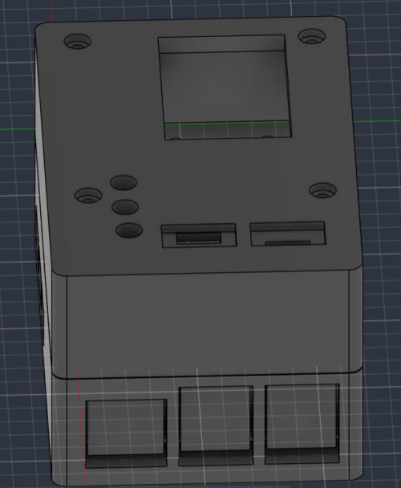

# TASK_05 — плата Motion Logger для Raspberry Pi 5 і корпус для 3D-друку

Завдання: намалювати в Altium плату-модуль, яка вставляється датчиками й одягається на Raspberry Pi, експортувати її у STEP, відкрити у Fusion і зробити корпус, у якому стоять Raspberry Pi і плата. Окремо — код під Raspberry Pi.

Автор: Роман Філоненко (РЕ-51, КПІ). Дата: 05.10.2026.



## Структура репозиторію

```
TASK_05/
├── altium/                      проєкт Altium Designer (відкривати Motion_Logger.PrjPcb)
│   ├── Motion_Logger.PrjPcb     файл проєкту
│   ├── Schematic/Sheet2.SchDoc  схема
│   ├── PCB/PCB2.PcbDoc          плата 85 × 56 мм, 2 шари
│   ├── Library/                 власні бібліотеки: символи (Schlib2) і футпринти (PcbLib2)
│   ├── Fab/                     Gerber + свердління (ZIP) і STEP плати для Fusion
│   ├── Project Outputs for Motion_Logger/   звіт перевірки правил (DRC), 0 помилок
│   └── CAMtastic*.Cam           службові файли Altium для Gerber
├── fusion/                      проєкт Fusion
│   ├── Motion_Logger_Case.f3d   модель (архів Fusion: відкривається через File → Open → Open from my computer)
│   ├── output/                  результат: STL для друку, STEP збірки
│   ├── inputs/                  вхідні STEP: плата з Altium і спрощена модель Pi 5
│   ├── script/                  скрипт Fusion (Python), що будує корпус
│   ├── tools/                   допоміжні скрипти перевірки (Python)
│   └── images/                  картинки: вигляд моделі і перерізи
└── code/                        код для Raspberry Pi (поки не написаний, див. code/README.md)
```

## 1. Altium: плата Motion Logger

Плата розміром 85 × 56 мм (як Raspberry Pi 5) одягається на гребінку 2×20 Raspberry Pi. Кріпильні отвори ⌀2,7 мм на 58 × 49 мм збігаються з отворами Pi. Товщина 1,6 мм, 2 шари, модулі стоять зверху. Власних джерел живлення на платі нема: 3,3 В беруться з Pi.

Модулі й елементи на платі:

| Позначення | Що це | Інтерфейс |
|---|---|---|
| `U1` | GPS NEO-6M (модуль HW-623) | UART |
| `U2` | GY-87 (HW-290): MPU6050 + HMC5883L + BMP180 | I2C |
| `U3` | ADXL345 (модуль GY-291) | SPI |
| `SW1`, `SW2` | дві кнопки (HW-483, KY-004) | GPIO |
| `D1`–`D3` + `R1`–`R3` | RGB-світлодіод з трьох окремих світлодіодів і резисторів | GPIO |
| `J1` | гніздо 2×20 під Raspberry Pi 5 | — |

### Підключення пінів Pi 5

| Пін `J1` | GPIO | Мережа | Куди |
|---|---|---|---|
| 1, 17 | 3V3 | `VCC` | живлення модулів і кнопок |
| 6, 9, 14, 20, 25, 30, 34, 39 | GND | `GND` | земля |
| 3 / 5 | GPIO2 / GPIO3 | `I2C_SDA` / `I2C_SCL` | GY-87 |
| 7 / 29 | GPIO4 / GPIO5 (uart2) | `UART_TX` / `UART_RX` | GPS |
| 19 / 21 / 23 / 24 | GPIO10 / 9 / 11 / 8 | `SPI_MOSI` / `MISO` / `SCLK` / `CS0` | ADXL345 |
| 11 / 33 | GPIO17 / GPIO13 | `BTN` / `BTN2` | кнопки `SW1` / `SW2` |
| 13 / 15 / 31 | GPIO27 / GPIO22 / GPIO6 | `LED_R` / `LED_G` / `LED_B` | світлодіоди |

Правила проєктування пройдено без порушень (DRC: 0). Звіт: `altium/Project Outputs for Motion_Logger/`.

Файли для виробництва: `altium/Fab/Motion_Logger_Gerber.zip` (шари, контур, свердління металізованих і неметалізованих отворів окремо). STEP для Fusion: `altium/Fab/Motion_Logger_board.step`.

Версія Altium Designer, у якій зроблено проєкт: 26.10.1.

## 2. Fusion: корпус

Корпус складається з **основи** і **кришки**. Усередині: Raspberry Pi 5 на 4 стійках, над ним на стійках M2.5 плата Motion Logger.

Модель збудовано скриптом Fusion (Python API) за розмірами зі STEP плати з Altium і офіційного STEP Raspberry Pi 5. Опис кроків: розділ «Як зроблено» нижче.

Головні розміри (мм; система координат: лівий нижній кут плати = (0;0), Z = 0 — верх плати):

| Що | Значення |
|---|---|
| Зовнішній розмір корпусу | 95,6 × 65,0 × 52,9 |
| Стінки / дно / верх кришки | 3,0 / 3,0 / 4,0 |
| Висота від верху плати Pi до низу плати Motion Logger | 20,0 (довжина стійок M2.5) |
| Висота над платою Motion Logger | 20,0 (гребінка 8,5 + модуль 10 + запас 1,5) |
| Стійки під Pi | ⌀7, висота 3,0, гвинти M2.5 знизу |
| Кришка | 4 гвинти M2.5 згори крізь труби кришки і плату в стійки |

Вікна й отвори:
- Права стіна: Ethernet і два блоки USB Raspberry Pi.
- Нижня стіна: USB-C живлення і два micro-HDMI.
- Ліва стіна: карта microSD.
- Дно: 5 щілин під процесором (пасивне охолодження, кулера нема).
- Кришка: 3 світловоди під світлодіоди, вікно на весь модуль GPS, дві ніші під модулі кнопок зі щілиною для дротів.

Перевірки (скрипти в `fusion/tools/`): перетинів основи і кришки з платою та Pi немає, найменший зазор основи до роз'ємів Pi 0,74 мм, перерізи в `fusion/images/`.

### Друк
Використовуй STL з `fusion/output/`:
- `Case_Base_print.stl` — основа, друкувати як є (дном вниз);
- `Case_Lid_print_flipped.stl` — кришка, уже перевернута верхом на стіл.

Зазори 0,2–0,3 мм і стінки 3 мм — загальні правила, не перевірені на конкретному принтері. Матеріал і принтер на момент створення не обрано.

### Як відкрити й змінити
- Модель: `File → Open → Open from my computer` → `fusion/Motion_Logger_Case.f3d`.
- Змінити розмір: поправ параметри на початку `fusion/script/MotionLoggerCase.py` (`H`, `CAV`, `W`, вікна). У Fusion: `Utilities → Add-Ins → Scripts and Add-Ins` → `+` → `Script or add-in from device` → вибрати папку `fusion/script` → `Run`. Скрипт створить новий документ і запише STL/STEP в `fusion/output/`.

## 3. Код для Raspberry Pi
Див. [code/README.md](code/README.md). Станом на 05.10.2026 код не написаний.

## Як зроблено корпус (коротко)
1. Плату намальовано в Altium, STEP експортовано (`altium/Fab/Motion_Logger_board.step`). У ньому лише плата, гніздо `J1`, резистори й світлодіоди; виводи резисторів і світлодіодів звисали на 27 мм униз.
2. Офіційний STEP Raspberry Pi 5 (Raspberry Pi Ltd, ліцензія MIT) завважкий (77 МБ, 2689 тіл). З нього зчитано габарити роз'ємів і зроблено спрощену модель `fusion/inputs/pi5_proxy.step` (`fusion/tools/make_pi5_proxy.py`). У платі лишено тіло плати, гніздо й колби світлодіодів без виводів (`fusion/tools/make_plate_input.py`).
3. Висоту між Pi і платою розраховано за STEP: роз'єми USB стоять на 16,2 мм над платою Pi, пластик гребінки Pi 2,57 мм, штирі ще 6,0 мм.
4. Скрипт `fusion/script/MotionLoggerCase.py` імпортує обидва STEP, ставить їх у потрібні місця й будує основу та кришку (тіла з об'ємними логічними операціями), експортує STL і STEP.
5. Результат перевірено в Python (OpenCascade): перетини, зазори, перерізи.

Під час роботи використовувався ШІ-асистент Claude (Anthropic): він читав STEP-файли, рахував розміри, писав скрипт Fusion і перевірки. Рішення щодо конструкції (висота стека, гвинти, кнопки в кришці, живлення тільки через USB-C Pi, вікно GPS, товщина стінок) ухвалював Роман.

## Що не перевірено
- Друк і примірка на реальному залізі.
- Довжина виступаючих штирів гребінки-подовжувача, повна висота стека (стійки 20 мм проти розрахованих 19,57 мм).
- Розмір модуля кнопки (8 × 15 мм взято з бібліотеки Altium, не з виміру) і місце антени GPS.
- Довжини гвинтів і стійок (орієнтовно: M2.5 × 10 знизу, M2.5 × 30 згори, стійки M2.5 × 20 мама-мама).

## Ліцензії та джерела
- 3D-модель Raspberry Pi 5: Raspberry Pi Ltd, MIT, <https://datasheets.raspberrypi.com/rpi5/RaspberryPi5-step.zip> (в репозиторії лише спрощена модель, зроблена з її розмірів).
